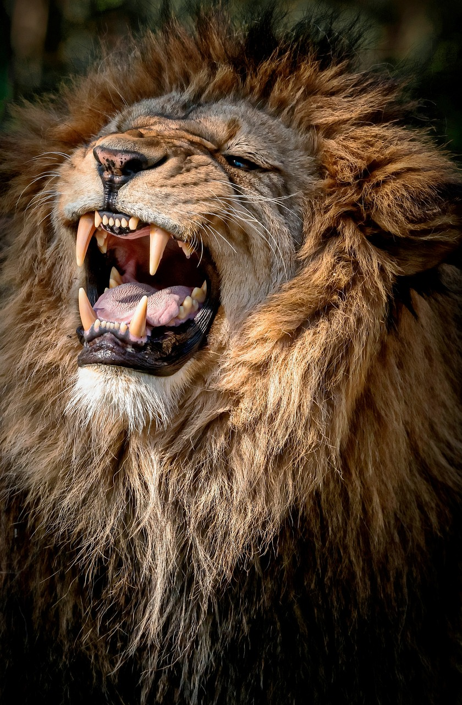

<!-- No borrar o modificar -->
[Inicio](./index.md)

## Sesión 3 

```
<!DOCTYPE html>
<html>

<head>
    <title>Sitio web con multimedia</title>

    <link rel="stylesheet" href="css/Style.css">

</head>
<nav class="index">
<body>
    <nav class=" title">
    <h1>Animales </h1>
    </nav>


    <div>
        
        <ul>
           
            <a href="index.html" target="_self" style="text-decoration: none;">Inicio</a>
            <a href="tigre.html" target="_self" style="text-decoration: none;">Tigre</a>
            <a href="leon.html" target="_self" style="text-decoration: none;">Leon</a>
            <a href="lobo.html" target="_self" style="text-decoration: none;">Lobo</a>
            <a href="leopardo.html" target="_self" style="text-decoration: none;">Leopárdo</a>
            <a href="mas.html" target="_self" style="text-decoration: none;">Más...</a>

        </ul><br><br><br>


    </div>


</body>
</nav>
</html>
```


```
<!DOCTYPE html>
<html lang="en">

<head>
    <meta charset="UTF-8">
    <meta name="viewport" content="width=device-width, initial-scale=1.0">
    <link rel="stylesheet" href="css/Style.css">
    <title>lelon</title>
</head>

<body>
   
        <div>
            <center>
                <h1>Leon</h1>
                <ul>

                    <a href="index.html" target="_self" style="text-decoration: none;">Inicio</a>
          <a href="tigre.html" target="_self" style="text-decoration: none;">Tigre</a>
            <a href="leon.html" target="_self" style="text-decoration: none;">Leon</a>
            <a href="lobo.html" target="_self" style="text-decoration: none;">Lobo</a>
            <a href="leopardo.html" target="_self" style="text-decoration: none;">Leopárdo</a>
                </ul>
            </center>

        </div>

        
        <p>
            El león (Panthera leo) es un mamífero carnívoro de la familia de los félidos y una de las cinco especies del
            género Panthera. Los leones salvajes viven en poblaciones cada vez más dispersas y fragmentadas del África
            subsahariana (a excepción de las regiones selváticas de la costa del Atlántico y la cuenca del Congo) y una
            pequeña zona del noroeste de India (una población en peligro crítico en el parque nacional del Bosque de Gir
            y alrededores), habiendo desaparecido del resto de Asia del Sur, Asia Occidental, África del Norte y la
            península balcánica en tiempos históricos. Hasta finales del Pleistoceno, hace aproximadamente diez mil
            años, de los grandes mamíferos terrestres, el león era el más extendido tras los humanos. Su distribución
            cubría la mayor parte de África, gran parte de Eurasia, desde el oeste de Europa hasta la India, y en
            América, desde el río Yukón hasta el sur de México.3​4​5​

            Si sobreviven a las dificultades de la infancia, las leonas que viven en un hábitat seguro, como por ejemplo
            el parque nacional Kruger, a menudo pueden llegar a la edad de doce a catorce años, mientras que los leones
            raramente viven más de ocho años.6​ Sin embargo, se conocen casos de leonas que han vivido hasta veinte años
            en estado salvaje. En cautiverio, tanto los machos como las hembras pueden vivir más de veinte años. Suelen
            vivir en sabanas y herbazales, aun cuando pueden entrar en zonas arbustivas y boscosas. Los leones son
            animales especialmente sociales en comparación con otros félidos. Una manada de leones se compone de hembras
            que tienen una relación familiar, sus crías y un número reducido de machos adultos. Las leonas suelen cazar
            juntas, en grupo, atacando principalmente a grandes ungulados. El león es un superpredador y clave, pese a
            que puede tener un comportamiento carroñero si tiene la oportunidad. Aun cuando los leones, normalmente, no
            cazan humanos de manera selectiva, algunos de ellos pueden convertirse en antropófagos y buscar presas
            humanas.

            El león es una especie vulnerable y, en su ámbito de distribución africano, a lo largo de las dos últimas
            décadas ha sufrido un declive de las poblaciones, posiblemente irreversible, de entre un 30 % y un 50 %;1​
            las poblaciones no son viables fuera de las reservas delimitadas y los parques nacionales. Aunque la causa
            de este declive no es del todo comprendida, la pérdida del hábitat y los conflictos con humanos son
            actualmente los motivos de preocupación más importantes. Se han tenido leones en cautividad desde los
            tiempos de la Antigua Roma, y desde finales del siglo XVIII han sido una especie muy buscada y exhibida en
            zoológicos por todo el mundo. Los propios zoológicos están colaborando en programas de reproducción para
            proteger la amenazada subespecie asiática.

            Los machos son muy fáciles de distinguir gracias a su melena, que hace de su cabeza uno de los símbolos
            animales más ampliamente conocidos de la cultura humana. Aparece muy a menudo en la literatura, la
            escultura, la pintura, en banderas nacionales, y en películas y literatura contemporáneas.</p>

        <video src="videos/videoleon.mp4" width="300" controls></video><br><br>

        <audio src="Audios/Leon.mp3" controls></audio>

   
</body>

</html>
```


